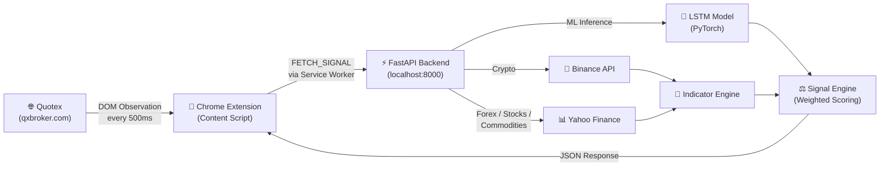
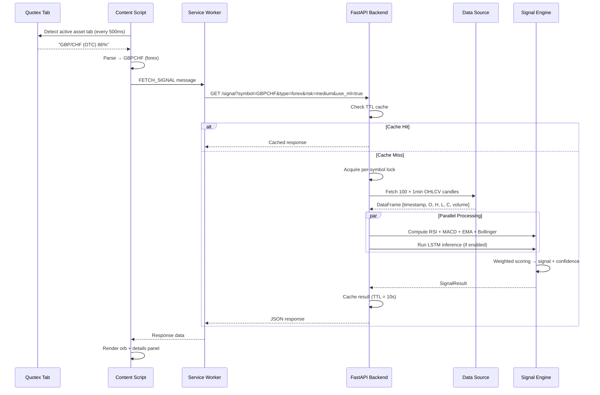
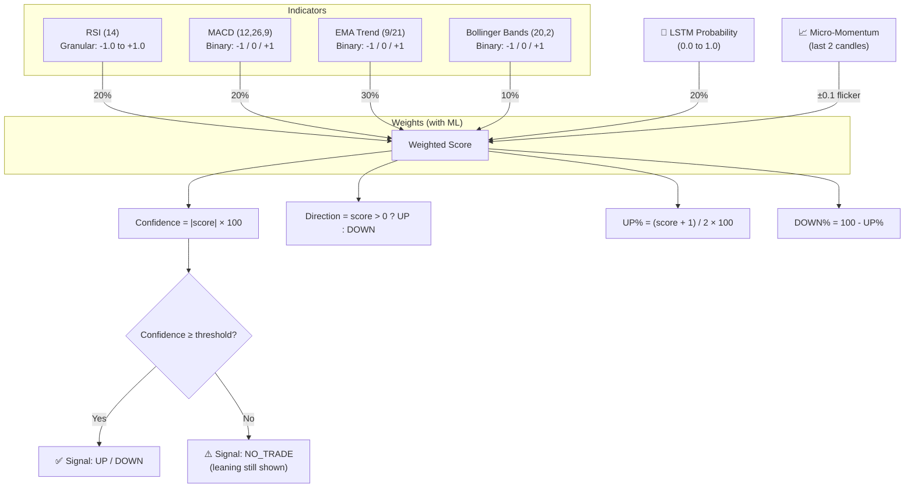
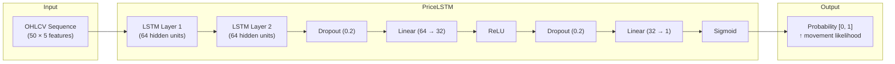
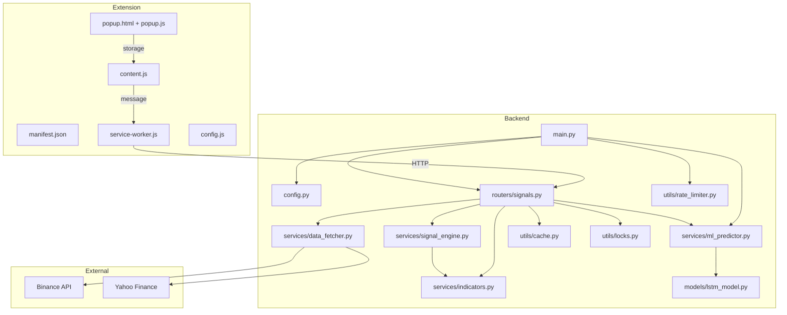

# 📈 Arix - Trading Signal Analyzer

> A production-grade **Chrome Extension** (Manifest V3) + **FastAPI** backend that delivers real-time trading signals (UP / DOWN / NO_TRADE) with confidence scoring, powered by technical analysis and an optional LSTM deep learning model.

**No API keys required** — all data sources are publicly accessible no external api keys required for any api calls.

---

## ✨ Features

| Feature | Description |
|---|---|
| **Real-Time Signals** | Live UP/DOWN/NO_TRADE signals with confidence scoring (0–100%) |
| **4 Technical Indicators** | RSI (14), MACD (12,26,9), EMA Trend (9/21), Bollinger Bands (20,2) |
| **Multi-Asset Support** | Crypto, Forex, Stocks, Commodities — 60+ symbols |
| **LSTM ML Model** | Optional deep learning predictions blended with technical analysis |
| **3 Risk Levels** | LOW (conservative), MEDIUM (balanced), HIGH (aggressive) |
| **Auto-Detection** | Automatically detects the active asset from Quotex tabs |
| **HUD Overlay** | Draggable, expandable orb with glassmorphism dark theme |
| **Sub-second Latency** | In-memory TTL cache, async locks, rate limiting |
| **Zero Config** | No API keys, no database, no Redis — just run and go |

---

## 🏗️ System Architecture

### High-Level Overview



### Request Lifecycle



---

## 📐 Signal Engine — How It Works

### Scoring Pipeline

The signal engine combines multiple indicators into a single **weighted score** from `-1.0` (strong bearish) to `+1.0` (strong bullish):



### Indicator Weights

| Indicator | Without ML | With ML |
|---|---|---|
| RSI (14) | 25% | 20% |
| MACD (12,26,9) | 25% | 20% |
| EMA Trend (9/21) | 40% | 30% |
| Bollinger Bands (20,2) | 10% | 10% |
| LSTM Model | — | 20% |

### Risk Level Thresholds

| Risk Level | Min Confidence for Trade | Description |
|---|---|---|
| `low` | 75% | Only very high-confidence signals |
| `medium` | 55% | Balanced — default |
| `high` | 35% | Aggressive — more frequent signals |

### Understanding the Orb Display

| Orb Element | Meaning |
|---|---|
| **Percentage** (e.g., `25%`) | **Confidence** — how strongly all indicators agree on the direction |
| **Arrow** (`↑` / `↓`) | **Leaning direction** — which side has more probability (always shown) |
| **Border color** (green / red) | Matches the leaning direction |
| **ML badge** (green = active) | Whether LSTM predictions are enabled |

### RSI Scoring (Granular)

| RSI Value | Score | Interpretation |
|---|---|---|
| < 20 | +1.0 | Strongly oversold → bullish |
| 20–30 | +0.7 | Oversold → bullish |
| 30–40 | +0.3 | Slightly oversold |
| 40–60 | 0.0 | Neutral |
| 60–70 | -0.3 | Slightly overbought |
| 70–80 | -0.7 | Overbought → bearish |
| > 80 | -1.0 | Strongly overbought → bearish |

---

## 🚀 Quick Start

### Prerequisites

- **Python 3.11+**
- **Google Chrome** (or Chromium-based browser)
- **PyTorch** (optional, for ML predictions)

### 1. Backend Setup

```bash
# Clone and navigate
cd "backend"

# Create virtual environment
python -m venv venv
venv\Scripts\activate         # Windows
# source venv/bin/activate    # Linux/Mac

# Install dependencies
python -m pip install -r requirements.txt

# Configure environment
cp .env.example .env
# Edit .env as needed

# Start the server
uvicorn main:app
```

The API will be available at `http://127.0.0.1:8000`.

**Verify it's working:**
```bash
# Health check
curl http://127.0.0.1:8000/health

# Test signal (crypto)
curl "http://127.0.0.1:8000/signal?symbol=BTCUSDT&type=crypto&risk=medium"

# Test signal (forex)
curl "http://127.0.0.1:8000/signal?symbol=EURUSD&type=forex&risk=medium"
```

### 2. Frontend Dashboard Setup

The project includes a professional React dashboard for downloading and managing the extension.

```bash
# Navigate to UI directory
cd "ui/arix ui"

# Install dependencies
npm install

# Start the dev server
npm run dev
```

The dashboard will be available at `http://localhost:5173`.

### 3. Chrome Extension Setup

You can install the extension in two ways:

**Option A: via Dashboard (Recommended)**
1. Ensure the Frontend Dashboard is running.
2. Navigate to `http://localhost:5173`.
3. Click the **"Download Extension (.zip)"** button.
4. Extract the downloaded ZIP file to a folder.
5. Open Chrome → `chrome://extensions`.
6. Enable **Developer mode**.
7. Click **Load unpacked** and select the extracted folder.

**Option B: Manual Load**
1. Open Chrome → `chrome://extensions`.
2. Enable **Developer mode**.
3. Click **Load unpacked**.
4. Select the `ui/arix ui/public/extension` folder.

**Verify Installation:**
Navigate to `qxbroker.com` — the Arix signal orb will automatically inject into the trading interface.

### 4. Configure (Optional)

Click the extension icon in the Chrome toolbar to:
- **Change the API URL** (for remote deployment)
- **Test the connection** to verify the backend is reachable
- **Toggle ML predictions** on/off

---

## 📡 API Reference

### `GET /signal`

Returns a trading signal for the specified asset.

**Parameters:**

| Parameter | Type | Required | Default | Description |
|-----------|------|----------|---------|-------------|
| `symbol` | string | ✅ | — | Asset symbol (e.g., `BTCUSDT`, `EURUSD`, `GOLD`, `FACEBOOK`) |
| `type` | enum | ✅ | — | `crypto`, `forex`, `stock`, `commodity` |
| `risk` | enum | ❌ | `medium` | `low`, `medium`, `high` |
| `use_ml` | bool | ❌ | `true` | Include LSTM predictions in signal |

**Example Request:**
```
GET /signal?symbol=BTCUSDT&type=crypto&risk=medium&use_ml=true
```

**Example Response:**
```json
{
  "signal": "UP",
  "confidence": 78,
  "leaning": "UP",
  "up_percent": 89,
  "down_percent": 11,
  "indicators": {
    "rsi": {
      "value": 42.3,
      "signal": "NEUTRAL"
    },
    "macd": {
      "value": 0.002300,
      "signal_line": 0.001000,
      "histogram": 0.001300,
      "signal": "BULLISH"
    },
    "ema_trend": {
      "short": 67845.120000,
      "long": 67812.450000,
      "value": 1.0,
      "signal": "BULLISH"
    },
    "bollinger": {
      "upper": 68200.50,
      "middle": 67900.00,
      "lower": 67599.50
    }
  },
  "ml_prediction": {
    "probability": 0.7234,
    "enabled": true
  },
  "risk_level": "medium",
  "asset": {
    "symbol": "BTCUSDT",
    "type": "crypto"
  },
  "timestamp": "2026-05-02T17:00:00+00:00",
  "execution_time": 167.92
}
```

**Error Responses:**

| Status | Reason |
|---|---|
| `422` | Insufficient market data (< 35 candles) or invalid parameters |
| `429` | Rate limit exceeded (includes `Retry-After` header) |
| `500` | Internal server error |

### `GET /health`

Health check endpoint.

```json
{
  "status": "healthy",
  "version": "1.0.0",
  "ml_enabled": true
}
```

---

## 🗂️ Supported Assets Example

### Crypto (via Binance API — real-time)
`BTCUSDT` `ETHUSDT` `BNBUSDT` `SOLUSDT` `XRPUSDT` `DOGEUSDT` `ADAUSDT` `AVAXUSDT` `DOTUSDT` `MATICUSDT` `LINKUSDT` `LTCUSDT` `SHIBUSDT` `TRXUSDT` `ATOMUSDT`

### Forex (via Yahoo Finance)
`EURUSD` `GBPUSD` `USDJPY` `AUDUSD` `USDCAD` `USDCHF` `NZDUSD` `EURJPY` `GBPJPY` `CADJPY` `GBPCHF` `AUDCAD` `EURAUD` `CHFJPY` `EURGBP` `GBPNZD` `AUDNZD` `EURNZD` `GBPCAD` `AUDJPY` `GBPAUD` `USDPHP` `NZDJPY`

### Stocks (via Yahoo Finance)
`FACEBOOK → META` `APPLE → AAPL` `GOOGLE → GOOGL` `AMAZON → AMZN` `NETFLIX → NFLX` `TESLA → TSLA` `MICROSOFT → MSFT` `NVIDIA → NVDA` `INTEL → INTC` `ALIBABA → BABA` `VISA → V`

### Commodities (via Yahoo Finance Futures)
`GOLD → GC=F` `SILVER → SI=F` `OIL → CL=F` `BRENT → BZ=F` `NATURAL GAS → NG=F`

---

## 🧠 ML Model (LSTM)

### Architecture



| Specification | Value |
|---|---|
| Architecture | 2-layer LSTM + MLP classifier |
| Input | 50 OHLCV candles (normalized) |
| Features | Open, High, Low, Close, Volume |
| Output | Probability of upward movement [0, 1] |
| Normalization | % change from first candle's close; volume / mean |
| Parameters | ~35K |

### Training

```bash
# Navigate to ML directory
cd ml

# Train on BTC hourly data (default: 1000 candles, 50 epochs)
python train_lstm.py --symbol BTCUSDT --epochs 50

# Custom training
python train_lstm.py \
  --symbol ETHUSDT \
  --interval 1h \
  --limit 2000 \
  --epochs 100 \
  --seq-length 50 \
  --output saved_models/lstm_model.pt
```

**Training data:** Downloaded live from Binance public API (no key needed).

### Enabling ML in Backend

```env
# In .env file
ML_ENABLED=true
ML_MODEL_PATH=ml/saved_models/lstm_model.pt
```

The backend gracefully falls back to technical-only signals if:
- PyTorch is not installed
- Model file is missing
- Insufficient data for inference (< 50 candles)

---

## ⚙️ Configuration

### Environment Variables

| Variable | Default | Description |
|---|---|---|
| `ML_ENABLED` | `true` | Enable LSTM predictions |
| `ML_MODEL_PATH` | `ml/saved_models/lstm_model.pt` | Path to trained model |
| `CACHE_TTL_CRYPTO` | `0` | Cache TTL for crypto signals (seconds) |
| `CACHE_TTL_OTHER` | `0` | Cache TTL for forex/stocks/commodities |
| `RATE_LIMIT_PER_MINUTE` | `2000` | Max requests per IP per minute |
| `CORS_ORIGINS` | `["*"]` | Allowed CORS origins |
| `HOST` | `0.0.0.0` | Server bind host |
| `PORT` | `8000` | Server bind port |

---

## 🧪 Testing

```bash
cd backend

# Run all tests
python -m pytest tests/ -v

# Run with coverage
python -m pytest tests/ --cov=. --cov-report=html
```

---

## 🐳 Deployment

### Docker

```bash
cd backend
docker build -t trading-signal-api .
docker run -p 8000:8000 -e ML_ENABLED=true trading-signal-api
```

### Render (Free Tier)

The project includes a `render.yaml` for one-click deployment:

```bash
# Push to GitHub, connect repo in Render dashboard
# Or use the render.yaml config:
```

```yaml
services:
  - type: web
    name: trading-signal-api
    runtime: python
    buildCommand: pip install -r requirements.txt
    startCommand: uvicorn main:app --host 0.0.0.0 --port $PORT
    rootDir: backend
    plan: free
    healthCheckPath: /health
```

After deploying, update the Chrome extension's API URL via the popup settings.

---

## 📁 Project Structure

```
stock-analyzer/
│
├── 📄 README.md 
├── 🎨 ui/arix ui/               # React Dashboard (Vite + Tailwind)
│   ├── public/extension/        # Chrome Extension Source (Manifest V3)
│   │   ├── manifest.json        # Extension manifest & permissions
│   │   ├── config.js            # Default configuration constants
│   │   ├── icons/               # Extension icons (16/48/128px)
│   │   ├── background/
│   │   │   └── service-worker.js# Message relay + fetch proxy
│   │   ├── content/
│   │   │   ├── content.js       # Main content script (Shadow DOM)
│   │   │   └── panel.css        # HUD panel styles
│   │   └── popup/
│   │       ├── popup.html       # Settings popup UI
│   │       └── popup.js         # Settings save/load/test logic
│   ├── src/Dashboard/           # Dashboard Components
│   └── components.json          # Shadcn/ui configuration
│
├── ⚡ backend/                  # FastAPI Backend
│   ├── main.py                  # App entry point, lifespan, middleware
│   ├── config.py                # Pydantic Settings (env-based config)
│   ├── Dockerfile               # Container deployment
│   ├── render.yaml              # Render.com deployment config
│   ├── requirements.txt         # Python dependencies
│   │
│   ├── routers/
│   │   └── signals.py           # GET /signal endpoint — orchestrates pipeline
│   │
│   ├── services/
│   │   ├── data_fetcher.py      # Unified data fetcher (Binance + Yahoo Finance)
│   │   ├── indicators.py        # RSI, MACD, EMA, Bollinger Bands (pure Pandas)
│   │   ├── signal_engine.py     # Weighted scoring → signal generation
│   │   └── ml_predictor.py      # LSTM model loading + inference
│   │
│   ├── models/
│   │   └── lstm_model.py        # PriceLSTM architecture (PyTorch)
│   │
│   ├── utils/
│   │   ├── cache.py             # Thread-safe in-memory TTL cache
│   │   ├── locks.py             # Per-symbol async lock manager
│   │   └── rate_limiter.py      # Sliding window rate limiter middleware
│   │
│   ├── tests/                   # pytest test suite
│   │
│   ├── .env.example           
│   └── .gitignore
│
└── 🧠 ml/                      # ML Training
    ├── train_lstm.py            # Training script (fetches data from Binance)
    └── saved_models/
        └── lstm_model.pt        # Trained model weight
```

### Component Dependency Graph



---

## 🔒 Security & Performance

| Mechanism | Implementation |
|---|---|
| **Rate Limiting** | Sliding window per-IP, configurable (default: 2000 req/min) |
| **CORS** | Configurable origins (default: `*` for development) |
| **CSP Bypass** | Extension service worker proxies fetch requests to localhost |
| **Cache** | Thread-safe in-memory TTL cache (no Redis needed) |
| **Async Locks** | Per-symbol locks prevent duplicate concurrent data fetches |
| **Shadow DOM** | Extension UI isolated from host page styles/scripts |
| **Graceful Fallback** | ML silently disabled if PyTorch missing or model unavailable |

---

## 🛠️ Tech Stack

| Layer | Technology |
|---|---|
| **Frontend** | Chrome Extension (Manifest V3), Shadow DOM, Vanilla JS |
| **Backend** | Python 3.11+, FastAPI, Uvicorn (ASGI) |
| **Data Sources** | Binance REST API, Yahoo Finance (yfinance) |
| **ML Framework** | PyTorch (LSTM) |
| **Data Processing** | Pandas, NumPy |
| **HTTP Client** | httpx (async), yfinance |
| **Config** | Pydantic Settings + .env |
| **Deployment** | Docker, Render.com |

---

## 🎥 Live Trading Demonstration

In the video demonstration, I showcase Arix in action. **I made two trades using this prediction bot — one resulted in a loss, and the other was a win**, illustrating the realistic performance, real-time signal generation, and practical workflow of the system on a live chart.

https://github.com/user-attachments/assets/2e309b92-e576-4533-8b92-4dad4f93ca4e

---

## ⚠️ Disclaimer

> **This tool is for educational and informational purposes only.** Trading signals generated by this software are not financial advice. Past performance of technical indicators and ML models does not guarantee future results. Always do your own research and never risk more than you can afford to lose. Use at your own risk.
---
